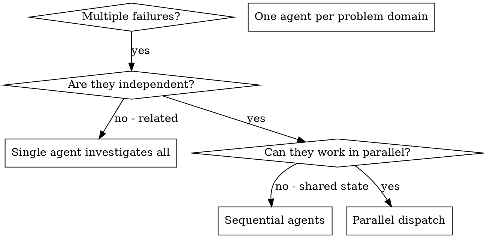

# Dispatching Parallel Agents

## Overview

You delegate tasks to specialized agents with isolated context. By precisely crafting their instructions and context, you ensure they stay focused and succeed at their task. They should never inherit your session's context or history -- you construct exactly what they need. This also preserves your own context for coordination work.

When you have multiple unrelated failures (different test files, different subsystems, different bugs), investigating them sequentially wastes time. Each investigation is independent and can happen in parallel.

**Core principle:** Dispatch one agent per independent problem domain. Let them work concurrently.

## When to Use



**Use when:**
- 3+ test files failing with different root causes
- Multiple subsystems broken independently
- Each problem can be understood without context from others
- No shared state between investigations

**Don't use when:**
- Failures are related (fix one might fix others)
- Need to understand full system state
- Agents would interfere with each other

## The Pattern

### 0. Ground-truth reconnaissance (mandatory for shared repos)

Before assigning tasks in any shared or long-lived repository, establish the live state. A work list built from a static brief is an upper bound, not a fact.

```bash
git fetch --all
git branch -avv
gh pr list --state all --limit 20
git worktree list
git status
```

Check for:
- Already-merged work (PRs closed since the brief was written)
- In-flight branches from concurrent or prior sessions (branches you did not create)
- Uncommitted work in the working tree (another session's staged edits)
- PRs you did not open that address the same tasks

If concurrent-session signals appear (remote branch with diverged history, recently-modified shared index, PRs opened by another actor), surface and confirm scope before fanning out. A parallel fan-out against a stale work list produces duplicate branches, duplicate PRs, and wasted agent cost.

### 1. Feasibility gate before fan-out

Before dispatching, validate that each candidate is real, live, and actually in scope. A work list built from "repos without X" or "files matching Y" silently includes dead targets (deleted repos, archived projects, mislabeled catalog entries).

For each candidate, run one cheap read-only probe:

- **Repos:** `gh api repos/{org}/{name}` to confirm existence; check `languages` and `pushed_at` to confirm active Python/relevant project
- **Files:** `test -f {path}` or `gh api repos/.../contents/{path}` to confirm existence at HEAD
- **Features:** a one-line grep to confirm the feature is actually absent before dispatching a "add X" agent

Drop or reclassify candidates that fail the probe. One probe call per candidate is cheap; paying full subagent cost on a deleted repo or mislabeled entry is not.

Treat the brief's task count as an upper bound to verify, not a number to fan out against.

### 2. Identify Independent Domains

Group failures by what's broken:
- File A tests: Tool approval flow
- File B tests: Batch completion behavior
- File C tests: Abort functionality

Each domain is independent -- fixing tool approval doesn't affect abort tests.

### 3. Create Focused Agent Tasks

Each agent gets:
- **Specific scope:** One test file or subsystem
- **Clear goal:** Make these tests pass
- **Constraints:** Don't change other code
- **Expected output:** Summary of what you found and fixed

### 4. Dispatch in Parallel

```typescript
// In Claude Code / AI environment
Task("Fix agent-tool-abort.test.ts failures")
Task("Fix batch-completion-behavior.test.ts failures")
Task("Fix tool-approval-race-conditions.test.ts failures")
// All three run concurrently
```

### 5. Review and Integrate

When agents return:
- Read each summary
- Verify fixes don't conflict
- Run full test suite
- Integrate all changes

## Agent Prompt Structure

Good agent prompts are:
1. **Focused** -- One clear problem domain
2. **Self-contained** -- All context needed to understand the problem
3. **Specific about output** -- What should the agent return?

```markdown
Fix the 3 failing tests in src/agents/agent-tool-abort.test.ts:

1. "should abort tool with partial output capture" - expects 'interrupted at' in message
2. "should handle mixed completed and aborted tools" - fast tool aborted instead of completed
3. "should properly track pendingToolCount" - expects 3 results but gets 0

These are timing/race condition issues. Your task:

1. Read the test file and understand what each test verifies
2. Identify root cause - timing issues or actual bugs?
3. Fix by:
   - Replacing arbitrary timeouts with event-based waiting
   - Fixing bugs in abort implementation if found
   - Adjusting test expectations if testing changed behavior

Do NOT just increase timeouts - find the real issue.

Return: Summary of what you found and what you fixed.
```

## Common Mistakes

**Vague scope:** "Fix all the tests" -- agent gets lost
**Specific:** "Fix agent-tool-abort.test.ts" -- focused scope

**No context:** "Fix the race condition" -- agent doesn't know where
**Context:** Paste the error messages and test names

**No constraints:** Agent might refactor everything
**Constraints:** "Do NOT change production code" or "Fix tests only"

**Vague output:** "Fix it" -- you don't know what changed
**Specific:** "Return summary of root cause and changes"

**Config generation without sibling reconciliation:** Asking an agent to generate
a new tooling config file without reading existing sibling configs -- the agent
faithfully follows your literal scope and contradicts an existing repo decision.
Always instruct config-generating agents to: "First read any existing linter,
formatter, or CI config files (qlty.toml, ruff config, pyproject.toml tool
sections) and align the new config's scope with established exclusions. Flag
any divergence before writing."

**Shared sequential namespace allocation:** When parallel agents must mint
identifiers from a shared monotonic space (check IDs, migration numbers, port
numbers, fixture indices), each agent independently picks "the next free number"
and collisions are certain. Two classes of collision to prevent:
- **Stale-read:** Agent A counts from a partial view and picks an ID that already exists
- **Race-condition:** Agents A and B both read the max, both increment by 1, both write the same number

**Solution:** Allocate ranges centrally BEFORE dispatch:

```
Agent 1 (docs): use IDs CI-067 through CI-072 (first 6 slots)
Agent 2 (security): use IDs CI-073 through CI-078 (next 6 slots)
Agent 3 (toolchain): use IDs CI-079 through CI-084 (next 6 slots)
```

If central allocation is impractical, instruct agents to mark allocations as
PROVISIONAL and require a downstream uniqueness gate at integration time:

```
Your suggested check IDs are provisional. Before committing, verify each
against both sibling output files AND the live manifest to detect collisions.
```

Always run a post-dispatch collision sweep against both sibling outputs AND the live
namespace, not just a file-conflict check.

## Fleet Migration Orchestration

When dispatching parallel agents for a fleet-scale migration (N repos, config changes, tool swaps):

**Crash resilience:** Transient infra errors (socket closed, API overloaded) are certain
across N long runs. Design for it:

1. Instruct every per-repo agent to **commit and push the foundational config FIRST**,
   then push fixes incrementally per-subdirectory. Any crash preserves progress on the remote.
2. On a crash notification, the controller must **verify actual state** (check the remote
   branch, run the linter on the pushed branch) rather than trust the notification. A
   "crashed" agent may have already finished and pushed.
3. **Recover finished-but-unpushed work** by reading the agent's last known state,
   committing the validated diff, and pushing -- do not re-run a full agent on already-clean code.
4. Prefer a **fresh focused continuation agent** (clone the pushed branch, do only the
   remainder) over resuming a bloated transcript. A crashed agent with 200+ tool calls
   of context tends to re-crash.

**Verify-before-propagate:** Any artifact that propagates to N repos (a config key,
an exclude pattern, a hook revision) must be validated ONCE at the source before fan-out.
An unverified config key in a template multiplies by N. Before baking any option into
a fleet-wide template:

- Verify the exact option name against the tool's `--help` or documented option list
- Run the template against one real repo and confirm the linter/tool accepts it
- Mark options as "VERIFY before fleet use" when you are not certain of their name

**Phantom entries:** Enumerate fleet scope from the catalog but expect phantom entries
(a listed repo may have been deleted). Agents must STOP-and-report on clone failure
(404, empty repo, wrong language), never substitute another repo from the list.

## When NOT to Use

**Related failures:** Fixing one might fix others -- investigate together first
**Need full context:** Understanding requires seeing entire system
**Exploratory debugging:** You don't know what's broken yet
**Shared state:** Agents would interfere (editing same files, using same resources)

## Real Example from Session

**Scenario:** 6 test failures across 3 files after major refactoring

**Failures:**
- agent-tool-abort.test.ts: 3 failures (timing issues)
- batch-completion-behavior.test.ts: 2 failures (tools not executing)
- tool-approval-race-conditions.test.ts: 1 failure (execution count = 0)

**Decision:** Independent domains -- abort logic separate from batch completion separate from race conditions

**Dispatch:**
```
Agent 1 → Fix agent-tool-abort.test.ts
Agent 2 → Fix batch-completion-behavior.test.ts
Agent 3 → Fix tool-approval-race-conditions.test.ts
```

**Results:**
- Agent 1: Replaced timeouts with event-based waiting
- Agent 2: Fixed event structure bug (threadId in wrong place)
- Agent 3: Added wait for async tool execution to complete

**Integration:** All fixes independent, no conflicts, full suite green

**Time saved:** 3 problems solved in parallel vs sequentially

## Key Benefits

1. **Parallelization** -- Multiple investigations happen simultaneously
2. **Focus** -- Each agent has narrow scope, less context to track
3. **Independence** -- Agents don't interfere with each other
4. **Speed** -- 3 problems solved in time of 1

## Verification

After agents return:
1. **Review each summary** -- Understand what changed
2. **Check for conflicts** -- Did agents edit same code?
3. **Collision sweep** -- Did any parallel allocations (IDs, ports, numbers) collide?
4. **Run full suite** -- Verify all fixes work together
5. **Spot check** -- Agents can make systematic errors

## Real-World Impact

From debugging session (2025-10-03):
- 6 failures across 3 files
- 3 agents dispatched in parallel
- All investigations completed concurrently
- All fixes integrated successfully
- Zero conflicts between agent changes
