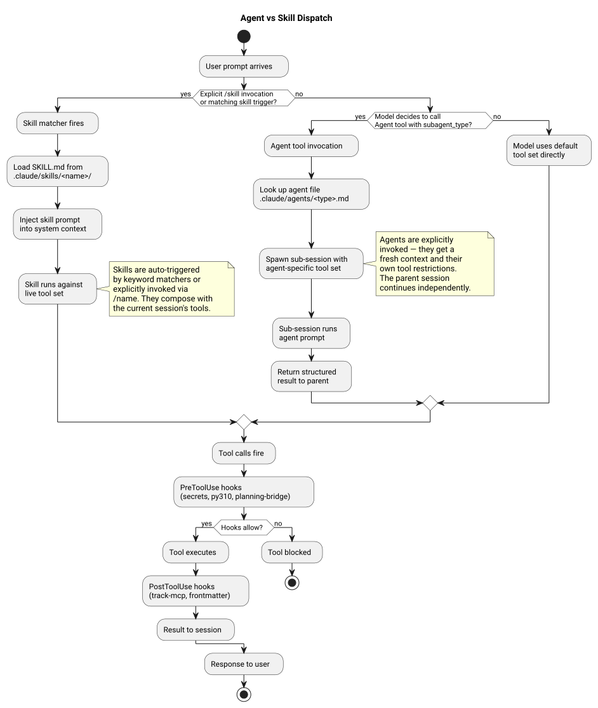

The repo provides two kinds of reusable capability: **agents** and **skills**. They look similar from the outside but invoke differently, run in different contexts, and are appropriate for different task shapes.

For the classification rubric and the reasoning behind this split, see [ADR-004](adr/ADR-004-skill-vs-agent-boundary.md).

## Mental Model

**Skills** are automations. A skill fires when the user triggers it: either with a slash command (`/commit`, `/quality`) or when matching keywords appear in the prompt. Skills run inside the main conversation window. They share the conversation's tool access, context, and state. Skills are fast, deterministic, and designed for one-shot transformations.

**Agents** are specialists. An agent is invoked explicitly: the main conversation (or another agent acting as supervisor) calls the `Agent` tool with a `subagent_type` parameter naming the specific agent. Agents run in a fresh, isolated context. Each agent has its own tool restrictions defined in its agent file. Agents are designed for multi-step, domain-isolated work: security audits, full test suite generation, code review with specific frameworks.

The practical difference: when you want something to happen automatically from a user action, write a skill. When you want to delegate a complex task to a specialist that works in isolation, write an agent.

## Diagram



## How Dispatch Works at Runtime

### Skill dispatch

1. The user types `/commit` or a message containing a skill's trigger keywords.
2. Claude Code's `Skill` tool matches the input against registered skill triggers.
3. The `Skill` tool fires the `PreToolUse` hook pipeline (specifically the planning bridge gate for Skill-matchers, then the universal hookify dispatch).
4. The skill's `SKILL.md` instructions load into the current conversation context.
5. The skill executes its steps within the main conversation window.
6. `PostToolUse` fires when the skill completes.

### Agent dispatch

1. The main conversation (or a supervisor) calls the `Agent` tool with `subagent_type: "code-reviewer"` (or whichever agent).
2. A new, isolated context window opens. The agent file (e.g., `.claude/agents/code-reviewer.md`) loads as the system prompt.
3. The agent has only the tools listed in its `tools:` frontmatter field. It cannot see or modify the parent conversation's state.
4. The agent completes its task and returns a single result message to the parent conversation.
5. The parent conversation continues with the agent's result in hand.

### Rules and Standards (not dispatched)

Rules (`.claude/rules/`) are not dispatched: they are loaded at session start via `CLAUDE.md` references and remain active throughout the session. Standards (`.claude/standards/`) are never dispatched or auto-loaded; they are read on demand via file reads when a task requires reference material.

## The Tool Restriction Model for Agents

Each agent file carries a `tools:` field in its YAML frontmatter listing the built-in Claude Code tools it can use:

```yaml
---
name: security-auditor
description: Security audit specialist for vulnerability detection and hardening.
tools: ["Read", "Bash", "Grep", "Glob"]
---
```

This is not a suggestion: it is enforced by the runtime. A `security-auditor` agent cannot call `Write` or `Edit` even if instructed to do so. This isolation is why agents can be trusted with high-stakes analysis: their scope is structurally bounded.

MCP tool bundles (Tier 2 in the MCP loading strategy) are loaded separately when a given agent is invoked. See [MCP Tiered Loading](mcp-tiered-loading.md) for how agent-bundled MCP tools compose with the built-in tool set.

## The Flat Agent Directory

All 59 agents live in `.claude/agents/` with no subdirectories. Domain grouping uses filename prefixes (`owasp-web.md`, `owasp-api.md`, `owasp-llm.md`). `setup.sh` creates a single symlink `~/.claude/agents/ → ~/dev/.claude/.claude/agents/`. A nested directory layout would require recursive symlink creation; the flat layout is simpler and makes `ls ~/.claude/agents/` a complete inventory.

Counts drift; `AGENTS-AND-SKILLS.md` is the registration source of truth, enforced by `tests/unit/test_catalog_registration.py`.

## See Also

- [ADR-004 Skill vs Agent Boundary](adr/ADR-004-skill-vs-agent-boundary.md): the full classification rubric
- [MCP Tiered Loading](mcp-tiered-loading.md): Tier 2 agent-bundled MCP tools
- [Reference → Agents Catalog](../reference/agents.md): the 59 agents and their domains
- [Reference → Skills Catalog](../reference/skills.md): the 40+ skills and their triggers
- [Contributing → Adding an Agent](../contributing/adding-agents.md)
- [Contributing → Adding a Skill](../contributing/adding-skills.md)
