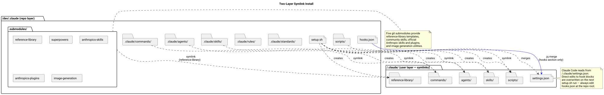
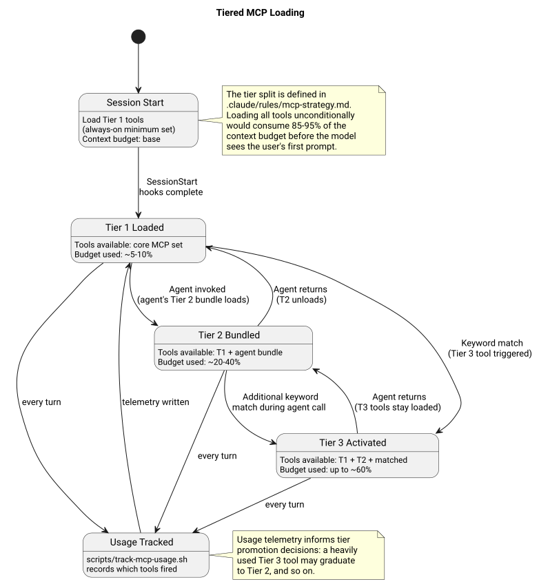

Architecture diagrams live as PlantUML source files (`.puml`) with committed SVG siblings. mkdocs renders the SVG directly; PUML sources are excluded from the build.

## Rendering

Choose one of the following options to regenerate SVGs when a `.puml` source changes:

1. **Project script** (recommended):

   ```bash
   ./scripts/render_diagrams.sh
   ```

   Renders all `docs/architecture/diagrams/*.puml`. Pass a specific path to render just one.

2. **`diagram-maintenance` skill**: use the skill in a Claude Code session on the `.puml` source.

3. **VS Code**: install the PlantUML extension, open the `.puml` file, press `Alt+D` (Linux/Windows) or `Option+D` (macOS).

4. **Online**: paste the source at <https://www.plantuml.com/plantuml/uml/> for a quick render.

## The Four Diagrams

| # | File | Depicts | Backing ADR |
| --- | --- | --- | --- |
| 1 | `install_layer.puml` | Repo at `~/dev/.claude`, symlinks into `~/.claude/`, jq-merge of `hooks.json` into `settings.json`. | [ADR-001](../adr/ADR-001-two-layer-symlink-install.md) |
| 2 | `hook_pipeline.puml` | Sequence diagram of hook execution across a single turn. | [ADR-002](../adr/ADR-002-hook-composition.md) |
| 3 | `agent_skill_dispatch.puml` | Activity diagram of Skill vs Agent dispatch at runtime. | [ADR-004](../adr/ADR-004-skill-vs-agent-boundary.md) |
| 4 | `mcp_tier_loading.puml` | State diagram of Tier 1/2/3 MCP context loading. | [ADR-003](../adr/ADR-003-tiered-mcp-loading.md) |

## Install Layer



## Hook Pipeline


## Agent vs Skill Dispatch


## MCP Tier Loading



## See Also

- [Architecture Overview](../index.md)
- [Writing Diagrams](../../contributing/writing-diagrams.md)
