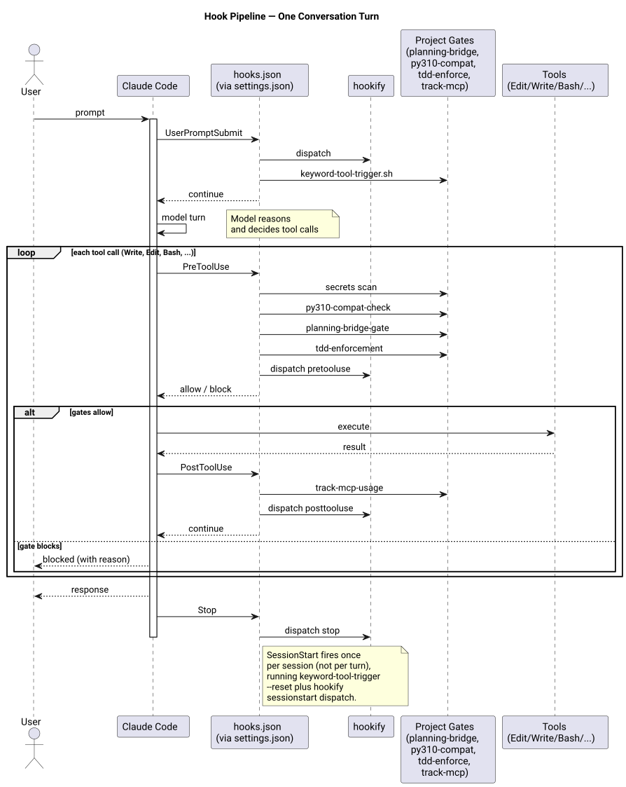

Claude Code fires hooks at five points during a session. These hooks enforce quality gates, route behavioral rules, and extend Claude's capabilities without requiring model-level changes. The hook definitions live in `hooks.json` at repo root and are merged into `~/.claude/settings.json` by `setup.sh`.

For the design decisions behind this system, see [ADR-002](adr/ADR-002-hook-composition.md).

## The Five Hook Types

**UserPromptSubmit** — fires immediately after the user sends a message, before Claude processes it. Used for: injecting context, detecting intent signals (PR review reminder), running the hookify user prompt pipeline.

**PreToolUse** — fires before each tool call Claude attempts. Each entry in the `PreToolUse` array can have a matcher regex targeting specific tools. Used for: secrets file guard (Edit/Write), planning bridge gate (Skill), security reminder (Edit/Write/MultiEdit), hookify dispatch (all tools).

**PostToolUse** — fires after each tool call completes. Used for: Python 3.10 compatibility check (Edit/Write), hookify dispatch (all tools).

**Stop** — fires when Claude finishes its turn (before control returns to the user). Used for: hookify stop handler.

**SessionStart** — fires once when a new Claude Code session opens. Not currently defined in `hooks.json` — available for future use.

## Diagram



## Execution Order Across a Turn

A single user message triggers the following hook sequence:

```text
User sends message
  → UserPromptSubmit[0]: hookify userpromptsubmit.py
  → UserPromptSubmit[1]: pr-review-reminder.py

  Model processes, issues tool calls:
    For each Write or Edit call:
      → PreToolUse[0]: secrets file guard (matcher: Edit|Write)
      → PreToolUse[2]: security reminder (matcher: Edit|Write|MultiEdit)
      → PreToolUse[3]: hookify pretooluse.py (all tools)
      → Tool executes
      → PostToolUse[0]: py310-compat-check (matcher: Edit|Write)
      → PostToolUse[1]: hookify posttooluse.py (all tools)

    For each Skill call:
      → PreToolUse[1]: planning bridge gate (matcher: Skill)
      → PreToolUse[3]: hookify pretooluse.py (all tools)
      → Tool executes
      → PostToolUse[1]: hookify posttooluse.py (all tools)

    For any other tool call:
      → PreToolUse[3]: hookify pretooluse.py (all tools)
      → Tool executes
      → PostToolUse[1]: hookify posttooluse.py (all tools)

  Model turn ends
    → Stop[0]: hookify stop.py
```

Array position determines execution order within each hook type. Matcher-specific entries run only when their regex matches the tool being called.

## Per-Hook Responsibilities

### UserPromptSubmit

| Script | What it does |
| --- | --- |
| `hookify/hooks/userpromptsubmit.py` | Dispatches to registered hookify plugins for the UserPromptSubmit event |
| `scripts/pr-review-reminder.py` | Detects when the user's message looks like a PR review request and injects a reminder about the review workflow |

### PreToolUse

| Matcher | Script | What it does |
| --- | --- | --- |
| `Edit\|Write` | Inline bash | Blocks writes to `.env` and `settings.local.json` with exit code 2 |
| `Skill` | `scripts/planning-bridge-gate.sh` | Enforces plan-approval workflow before any Skill invocation |
| `Edit\|Write\|MultiEdit` | `security_reminder_hook.py` | Surfaces OWASP-style security reminders when editing files |
| (all tools) | `hookify/hooks/pretooluse.py` | Dispatches to hookify plugin engine |

### PostToolUse

| Matcher | Script | What it does |
| --- | --- | --- |
| `Edit\|Write` | `scripts/py310-compat-check.sh` | Checks modified Python files for syntax that breaks on Python 3.10 |
| (all tools) | `hookify/hooks/posttooluse.py` | Dispatches to hookify plugin engine |

### Stop

| Script | What it does |
| --- | --- |
| `hookify/hooks/stop.py` | Dispatches to hookify plugin engine's stop handlers |

## hookify Dispatch

hookify is a plugin engine from the `anthropics-plugins` submodule (`claude-plugins-official`). It provides a shared rule engine that multiple plugins can hook into without each needing its own top-level hook entry. When hookify's `pretooluse.py` fires, it reads the list of registered plugins from `CLAUDE_PLUGIN_ROOT` and dispatches to each one's handler.

The `CLAUDE_PLUGIN_ROOT` environment variable is set inline in each hookify hook entry in `hooks.json`:

```bash
CLAUDE_PLUGIN_ROOT=$HOME/dev/.claude/.submodules/anthropics-plugins/plugins/hookify
```

This means hookify plugins are loaded from the submodule path, not from `~/.claude/`. Adding a new hookify plugin requires a submodule change, not just a `hooks.json` edit.

## Adding a New Hook

1. Write your script and place it in `scripts/`.
2. Add an entry to `hooks.json` under the appropriate hook type with the correct matcher.
3. Run `./setup.sh` to merge the updated `hooks.json` into `~/.claude/settings.json`.
4. Test with a Claude Code session.

For the full workflow, see [Contributing → Adding a Hook](../contributing/adding-hooks.md).

## See Also

- [ADR-002 Hook Composition and Ordering](adr/ADR-002-hook-composition.md) — why hooks.json is the source of truth
- [Install Model](install-model.md) — how hooks.json gets merged into settings.json
- [Contributing → Adding a Hook](../contributing/adding-hooks.md) — step-by-step hook authoring guide
